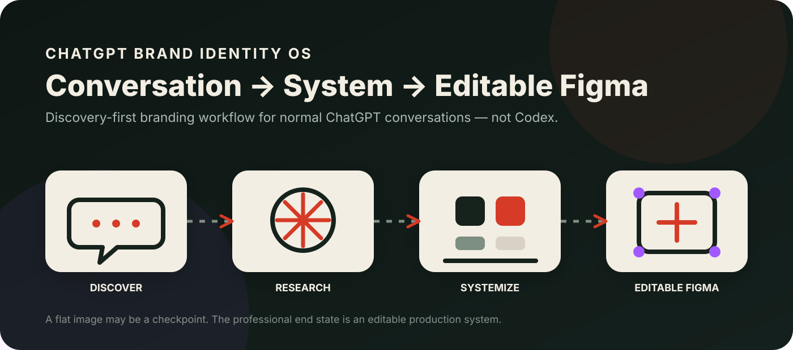
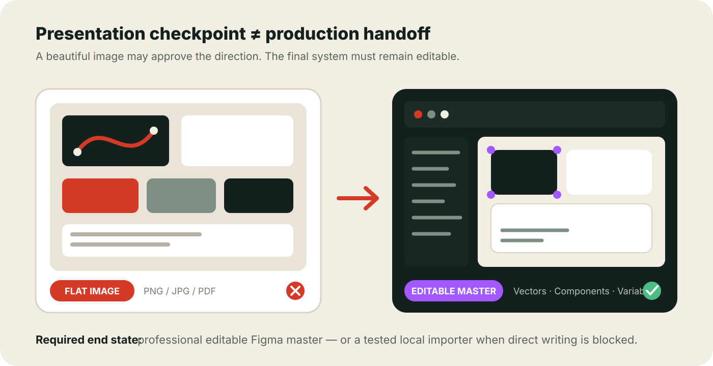

# ChatGPT Brand Identity OS

**English | [العربية](./README_AR.md)**

> **From a rough idea to a complete professional visual identity and a real editable Figma handoff — inside a normal ChatGPT conversation.**

[](./MASTER_BRAND_IDENTITY_OPERATING_SYSTEM.md)
[](https://chatgpt.com/)
[](./docs/FIGMA_REQUIRED_FINAL_OUTPUT.md)
[](#chatgpt-not-codex)
[](https://github.com/yazanmg/chatgpt-brand-identity-os/actions/workflows/verify-core.yml)

<p align="center">
  
</p>

---

> [!IMPORTANT]
> ## For normal ChatGPT conversations — **NOT Codex**
>
> Upload the canonical operating specification into a regular ChatGPT conversation together with whatever you already know about your project. The system guides the work through discovery, research, strategy, creative exploration, production, editable Figma, QA, and professional handoff.
>
> It is **not** an `AGENTS.md`, coding-agent rule set, repository instruction file, or Codex workflow.

> [!WARNING]
> ## The final deliverable is Figma — a flat image is not completion
>
> A brand board, moodboard, PNG/JPG, PDF, contact sheet, or screenshot can be used for exploration and approval, but it **must not be treated as the final result**.
>
> The required production end state is a **real professional editable Figma Brand Identity Master File**, or — when direct Figma writing is technically blocked — a tested local Figma Development Importer that reconstructs the editable master inside Figma Desktop.
>
> Copy the mandatory rule from **[Figma Required Final Output](./docs/FIGMA_REQUIRED_FINAL_OUTPUT.md)** and send it with the canonical operating specification.

---

## What is this?

**ChatGPT Brand Identity OS** is a tested, discovery-first operating specification for creating a complete professional visual identity with ChatGPT.

It is not a one-shot logo prompt and it should not stop after generating a beautiful presentation image.

<table>
<tr>
<td align="center" width="25%"><br><b>Conversation</b><br><sub>Start with what you know</sub></td>
<td align="center" width="25%"><br><b>Discovery</b><br><sub>Ask only what is missing</sub></td>
<td align="center" width="25%"><br><b>Brand System</b><br><sub>Strategy → identity → rules</sub></td>
<td align="center" width="25%"><br><b>Editable Figma</b><br><sub>Production-ready handoff</sub></td>
</tr>
</table>

The workflow helps ChatGPT understand the project first, ask only the questions that matter, research the real context, explore genuinely distinct creative directions, systematize the selected direction, stress-test it, convert it into production assets, and continue until another designer or developer can use the result without guessing.

The canonical operating specification is:

**[`MASTER_BRAND_IDENTITY_OPERATING_SYSTEM.md`](./MASTER_BRAND_IDENTITY_OPERATING_SYSTEM.md)**

That file is intentionally preserved **byte-for-byte exactly as tested**. Documentation and companion rules improve usage without rewriting the canonical core.

---

## Why this exists

A common AI branding path looks like:

```text
Logo concept
→ Moodboard
→ Beautiful brand board
→ PNG / PDF
→ Stop
```

That can be useful exploration, but it is not a complete professional identity handoff.

A production-ready identity may also require strategy, audience/category understanding, brand architecture, genuinely different creative territories, a complete logo family, clear-space/minimum-size rules, color and typography systems, multilingual/RTL behavior, iconography, graphic language, product-family logic, platform assets, accessibility validation, real-touchpoint testing, design tokens, editable vectors, Figma Variables/Components/Styles, export-ready masters, documentation, governance, and a handoff another professional can continue without guessing.

---

## What makes it different?

| Typical AI branding prompt | ChatGPT Brand Identity OS |
|---|---|
| Starts drawing immediately | Inspects evidence and discovers the problem first |
| Fixed questionnaire or no discovery | Adaptive one-question-at-a-time discovery |
| One-shot output | Multi-phase operating workflow |
| Logo-centric | Identity-system-centric |
| Style preference first | Strategy and evidence first |
| Random alternatives | Structurally distinct creative territories |
| Mockup polish can hide weak marks | Functional stress tests before beauty shots |
| Flat palette | Role-based color system; semantic tokens where relevant |
| English-first | Multilingual / RTL aware when required |
| “Looks good” = done | Completion gates + three QA passes |
| PNG/PDF ending | Editable production assets + Figma handoff |
| Figma described, not built | Editable Figma workflow + local importer fallback |

---

# Quick Start

## 1. Download the canonical file

[`MASTER_BRAND_IDENTITY_OPERATING_SYSTEM.md`](./MASTER_BRAND_IDENTITY_OPERATING_SYSTEM.md)

## 2. Open a normal ChatGPT conversation

Do **not** start this as a Codex coding task.

## 3. Upload the `.md` file and your project material

You can start with only a project name or one-sentence idea, or provide richer material such as a product brief, current logo, UI/UX, screenshots, Figma exports, existing guidelines, website copy, design tokens, app icons, packaging, or multi-product architecture.

You do **not** need a professional brief first.

## 4. Send the base start message

```text
Use MASTER_BRAND_IDENTITY_OPERATING_SYSTEM.md as the governing operating specification for this project.

Read all supplied project material first.

If the brief is incomplete, conduct the adaptive discovery interview one question at a time until the Brand Brief Sufficiency Gate passes.

Then continue through the complete professional brand identity workflow, including research, strategy, creative territories, production, editable master/Figma workflow, QA, and handoff as applicable to the real project.

Use STRICT MODE.
```

## 5. Append the mandatory Figma completion rule

Copy the rule from:

**[`docs/FIGMA_REQUIRED_FINAL_OUTPUT.md`](./docs/FIGMA_REQUIRED_FINAL_OUTPUT.md)**

This is the critical companion rule that prevents a generated image or brand board from being mistaken for the final handoff.

```text
Approved visual direction
        ↓
Production reconstruction
        ↓
Editable vectors / assets / system
        ↓
Professional editable Figma master
        ↓
QA + export-ready handoff
```

If direct Figma automation fails because of MCP/API limits, quota, plan restrictions, connection problems, or unsupported writes, the workflow must **not** stop at PNG/PDF. It must fall back to a **local Figma Development Importer Plugin** that reconstructs the editable master inside Figma Desktop.

## 6. Continue the conversation normally

If important information is missing, ChatGPT should ask focused questions instead of inventing answers. Once the brief is sufficiently clear, the workflow progresses through research, strategy, creative territories, production, Figma, and handoff.

Detailed guide: **[How to Use](./docs/HOW_TO_USE.md)**.

---

## The operating flow

```text
Project idea / existing project
        ↓
Inspect supplied evidence
        ↓
Adaptive discovery interview
        ↓
Brand Brief Sufficiency Gate
        ↓
Three-pass research
        ↓
Legacy audit when applicable
KEEP / EVOLVE / REPLACE
        ↓
Brand strategy
        ↓
Brand architecture
        ↓
Distinct creative territories
        ↓
Human selection / correction
        ↓
Logo + visual identity system
        ↓
Real-touchpoint validation
        ↓
Accessibility / localization / production QA
        ↓
Design tokens + platform assets where relevant
        ↓
Canonical editable masters
        ↓
Professional editable Figma
        ↓
Local importer fallback if direct writing is blocked
        ↓
Professional package + documentation
        ↓
Three-pass final QA
        ↓
FINAL
```

---

## Flat image vs editable production file

<p align="center">
  
</p>

The left side is useful for presentation and approval. The right side is what a production handoff needs: real editable vectors, layers, Components, Variables/Styles, and exportable masters.

---

## Start with almost nothing

The workflow can begin with:

```text
I am building a coffee delivery service for university students.
```

Instead of immediately inventing a logo and palette, the system progressively understands the offer, audience, decision context, alternatives, differentiation, desired perception, priority touchpoints, constraints, and definition of success.

Read **[Discovery Workflow](./docs/DISCOVERY_WORKFLOW.md)**.

---

## Three-pass research

**Pass A — Category, audience, and context** — understand the world the brand enters.  
**Pass B — Visual landscape and differentiation** — identify conventions, clichés, confusion risks, and whitespace.  
**Pass C — Platform, production, accessibility, and implementation** — verify the constraints the final identity must survive.

---

## Creative territories before final production

When broad exploration is justified, the workflow creates multiple **structurally different** creative territories — not the same logo in three colors. Each direction is compared on equivalent benchmark surfaces before the user selects or corrects the direction.

---

## Editable Figma, not a flattened board

> **A beautiful brand board is a presentation artifact. It is not the editable production master.**

The Figma handoff should use real editable structure where applicable:

- vector masters
- Pages and/or Sections
- Frames
- Components and useful Variants
- Variables
- Paint/Text Styles
- reusable graphic elements
- product/app icon masters
- design tokens where relevant
- export settings
- clean Master Assets separated from presentation frames

Recovery path:

```text
Direct Figma automation
        ↓
Small atomic writes
        ↓
Verify actual nodes after writes
        ↓
Adapt to page / plan limits with Sections
        ↓
Local Figma Development Plugin fallback
```

Read **[Mandatory Figma Final Deliverable](./docs/FIGMA_REQUIRED_FINAL_OUTPUT.md)** and **[Figma Workflow](./docs/FIGMA_WORKFLOW.md)**.

---

## Approved identity already looks great?

Do **not** restart branding just to obtain a Figma file. Use **[Approved Identity → Editable Figma](./examples/APPROVED_IDENTITY_TO_FIGMA.md)** to preserve the approved creative direction and productionize that exact work.

---

## ChatGPT, not Codex

| Environment | Intended use |
|---|---:|
| Normal ChatGPT conversation | ✅ Primary |
| ChatGPT + uploaded project files | ✅ Recommended |
| ChatGPT + image generation | ✅ Useful for exploration |
| ChatGPT + Figma access | ✅ Useful for editable handoff |
| ChatGPT web / desktop / mobile chat | ✅ |
| Codex repository workflow | ❌ Not intended |
| `AGENTS.md` replacement | ❌ |
| Coding-agent system prompt | ❌ |

Read **[ChatGPT, Not Codex](./docs/CHATGPT_NOT_CODEX.md)**.

---

## STRICT MODE

`STRICT MODE` requires, among other things, discovery when the brief is insufficient, inspection of supplied evidence before repetitive questions, no invented business facts, appropriate research depth, re-verification of changing standards, functional stress tests, canonical editable sources, verification after Figma writes, no downgrade to images when remote automation fails, and `FINAL` only after applicable completion gates pass.

Read **[STRICT MODE](./docs/STRICT_MODE.md)**.

---

## Tested through real project work

The specification was developed iteratively during real identity work. Multiple earlier workflows were tried and compared; the exact canonical file in this repository is the version that produced the strongest overall result in that testing, so it is deliberately preserved unchanged.

One real test case involved a bilingual, multi-product digital travel ecosystem with existing UI/UX, Arabic + English, RTL/LTR, app icons, tokens, and editable Figma requirements.

See the sanitized **[SAFRA case study](./case-studies/SAFRA.md)**.

---

## Canonical core integrity

`MASTER_BRAND_IDENTITY_OPERATING_SYSTEM.md` is intentionally immutable for this release. Its SHA-256 fingerprint is stored in [`CORE_SHA256.txt`](./CORE_SHA256.txt), and GitHub Actions verifies it on pushes and pull requests.

This protects reproducibility: documentation, visuals, examples, and companion rules can improve without silently changing the tested prompt.

---

## Repository map

```text
.
├── MASTER_BRAND_IDENTITY_OPERATING_SYSTEM.md   # canonical tested core — do not edit
├── README.md                                    # English
├── README_AR.md                                 # العربية
├── assets/                                      # project visuals + icons
├── docs/
│   ├── FIGMA_REQUIRED_FINAL_OUTPUT.md
│   ├── HOW_TO_USE.md
│   ├── HOW_IT_WORKS.md
│   ├── DISCOVERY_WORKFLOW.md
│   ├── FIGMA_WORKFLOW.md
│   ├── STRICT_MODE.md
│   ├── FAQ.md
│   └── ar/                                      # Arabic documentation
├── examples/
├── templates/
├── case-studies/
├── figma/importer-template/
└── .github/workflows/
```

---

## License

- **Canonical operating specification and documentation:** CC BY 4.0
- **Code / automation examples:** MIT

See **[LICENSE.md](./LICENSE.md)**.

---

## Independence notice

This is an independent open-source project. It is not an official OpenAI, ChatGPT, Figma, Apple, Google, or Android project and is not endorsed by those companies. Product names are used descriptively to identify the intended environments.

---

## Project status

**Public release:** `v1.0.0`  
**Canonical core:** tested / stable / immutable for this release  
**Primary environment:** normal ChatGPT conversation  
**Required production end state:** editable Figma master or tested local importer fallback  
**Codex:** not the intended environment
